# ZK Age Verifier (zkAge Proof)

[](https://github.com/olatopeolajide1/LexzCodes/actions/workflows/ci.yml)


Prove **"I am at least 18 years old"** to a smart contract with a Groth16 zero-knowledge proof — **without ever revealing your birth date**. The proof is generated entirely in your browser; only a SNARK proof and an unlinkable nullifier touch the chain.

- 🧅 **Circuit:** Circom 2.1.6 (leap-year-aware calendar checks + Poseidon nullifier)
- 🔐 **Proving system:** Groth16 via snarkjs (self-contained local setup — no external ceremony files)
- ⛓️ **Chain:** Ethereum Sepolia
- 🖥️ **dApp:** Next.js 14 + viem (MetaMask & any injected wallet)

---

## 🎬 Demo (1 minute)

<!-- DEMO_VIDEO_LINK: after recording, DELETE the placeholder block below and UNCOMMENT the embed block for your host. Keep it a single clickable thumbnail so the README stays tidy. -->

<!-- ▶️ PLACEHOLDER (until the real video is uploaded): animated preview of the actual dApp flow -->
[](demo/README.md)

<!-- ▶️ YOUTUBE (uncomment and replace <id> once uploaded)
[](https://www.youtube.com/watch?v=<id>)
-->

<!-- ▶️ LOOM (uncomment and replace <key> once uploaded)
[](https://www.loom.com/share/<key>)
-->

<!-- ▶️ GOOGLE DRIVE (uncomment and replace <fileid> once uploaded)
[](https://drive.google.com/file/d/<fileid>/view)
-->

**What the video covers:** **wallet connect → in-browser ZK proof → on-chain verification result**, plus the terminal test run (7 passing) and the green CI badge. Full shot-by-shot script: [`demo/README.md`](demo/README.md).

## 📜 Deployed Contract (Sepolia)

| Contract | Address | Verified |
|---|---|---|
| **AgeVerifier** | `TBD — see Deploy section` | — |
| Groth16Verifier (auto-generated) | deployed alongside AgeVerifier | — |

> **Status:** not yet deployed — the deploy is fully scripted and takes ~2 minutes once a funded key exists. Until an address is filled in, the dApp shows a "not configured" banner.

### Deploy runbook (fills the address above)

```bash
# 1) Get Sepolia ETH for gas — any faucet works:
#    https://www.alchemy.com/faucets/ethereum-sepolia  (GitHub login)
#    https://cloud.google.com/application/web3/faucet/ethereum/sepolia
#    https://sepolia-faucet.pk910.de  (browser PoW mining, no login)

# 2) Put the funded key in .env (never committed — git-ignored):
cp .env.example .env
#    edit .env → SEPOLIA_PRIVATE_KEY=0x...

# 3) Deploy (~2 tx):
npm run deploy:sepolia
#    → prints Groth16Verifier and AgeVerifier addresses

# 4) Record the addresses:
#    • README.md → the table right above (this section)
#    • dapp/src/config.js → CONTRACT_ADDRESS

# 5) Optional but recommended:
npm run verify:sepolia -- <AgeVerifierAddress> <Groth16VerifierAddress>
```

A dedicated burner key was already generated for this deploy and is sitting in `.env` awaiting funds — send ≥ 0.01 Sepolia ETH to `0x7a38260C7F4D79027E5B708424C44E9eA0Ae05d5` and run step 3, or replace it with your own key.

## 🧠 What it proves

The circuit proves the statement:

> *"I know a valid calendar date `(day, month, year)` and a secret such that I have already had my 18th birthday as of the reference date — and `nullifier = Poseidon(year, month, day, secret)`."*

- Calendar-date validity is fully constrained in-circuit (month lengths, leap years via year % 4/100/400 divisibility witnesses).
- The **nullifier** makes the same birthdate+secret map to the same public value, so a proof cannot be replayed or copied between wallets — while revealing nothing about the date.
- The contract hard-pins the public `minAgeYears` signal to 18, rejecting proofs generated under any other policy.

## 🔒 Privacy Model

| Data | Visible on-chain / to the verifier? |
|---|---|
| "This wallet is 18+" attestation | ✅ Yes — that is the whole point |
| Nullifier (`Poseidon(year, month, day, secret)`) | ✅ Yes — one-way hash, unlinkable to an identity |
| Birth date (day/month/year) | ❌ **Never** — stays in browser memory |
| Secret (random, held by prover) | ❌ **Never** |
| Exact age, ID documents, other PII | ❌ **Never** |

**Trust assumptions (honest disclosure):**

1. **Reference date is prover-chosen.** The circuit proves 18+ *as of* `(refDay, refMonth, refYear)`, which is a public signal chosen at proof time. The dApp always uses "today" (UTC), and a relying party can require the anchor to be recent before trusting an attestation. Production hardening: commit to `block.timestamp` in-circuit.
2. **Self-declared birthdate.** The proof binds you to *a* birthdate — a production system should feed it a signed credential from an issuer (ZK-KYC / anonymous credentials). See the Roadmap in [PROPOSAL.md](PROPOSAL.md).
3. **Setup ceremony.** Powers-of-tau (2^12) and phase-2 are generated locally with two contributions + a beacon, which is fine for a demo; production should use a public multi-party ceremony.
4. Poseidon provides preimage resistance — the nullifier cannot be reversed to recover the birthdate.

## 🏗 Architecture

```
Browser (Next.js dApp)                     Chain (Sepolia)
┌──────────────────────────────┐           ┌───────────────────────────┐
│ birth date + secret (memory) │           │ AgeVerifier               │
│         │                    │  proof +  │  ├─ nullifierUsed[]       │
│         ▼                    │ nullifier │  ├─ isVerifiedAdult[]     │
│ snarkjs.groth16.fullProve    │──────────▶│  └─ verifyProof() ───────▶ Groth16Verifier
│ (wasm + zkey from /zk)       │           │        (snarkjs-exported) (snarkjs-generated)
└──────────────────────────────┘           └───────────────────────────┘
```

Public signals (5, snarkjs order): `[nullifier, minAgeYears, refDay, refMonth, refYear]` — everything else is private to the witness.

## 🚀 Quickstart

```bash
# 0) requirements: Node >= 20, curl (circom auto-installs into .tools/bin)

# 1) install
npm install

# 2) compile the circuit (Circom → r1cs/wasm)
npm run circom:build

# 3) Groth16 setup: local powers-of-tau → zkey → vkey → Groth16Verifier.sol
npm run setup:zkey

# 4) compile contracts + run tests (proofs are generated in-test)
npm run compile:contracts
npm test

# 5) run the dApp locally (copies ZK assets automatically)
npm run dev:dapp            # → http://localhost:3000
```

## 🧪 Testing

`npm test` runs 7 Hardhat tests that generate **real Groth16 proofs in-test** (no mocks):

1. ✅ valid 18+ proof accepted on-chain (`AgeVerified` emitted, wallet attested)
2. ✅ nullifier is deterministic for the same birthdate+secret (replay-binding)
3. ✅ underage user **cannot witness-generate** a proof at all
4. ✅ boundary case — proof whose 18th birthday falls after the reference date fails
5. ✅ tampered proof (`c` coordinate corrupted) rejected by the on-chain verifier
6. ✅ replaying the same proof is rejected (nullifier reuse)
7. ✅ proof generated under a different policy (`minAge=21`) rejected by the policy pin

## 📦 Deploy to Sepolia

```bash
cp .env.example .env          # fill SEPOLIA_PRIVATE_KEY (+ optional ETHERSCAN_API_KEY)
npm run deploy:sepolia        # prints both contract addresses
npm run verify:sepolia -- <AgeVerifierAddress> <VerifierAddress>   # optional
```

Then paste the printed **AgeVerifier** address into:

- [`dapp/src/config.js`](dapp/src/config.js) → `CONTRACT_ADDRESS`
- the table at the top of this README

Get test ETH from [sepoliafaucet.com](https://sepoliafaucet.com) or [faucets.chain.link/sepolia](https://faucets.chain.link/sepolia).

## 📁 Project Structure

```
.
├── circuits/
│   └── age_verification.circom      # the ZK statement (18+, calendar-valid, Poseidon nullifier)
├── contracts/
│   ├── AgeVerifier.sol              # on-chain verifier w/ nullifier replay protection
│   └── Groth16Verifier.sol          # auto-generated by snarkjs (do not edit)
├── dapp/                            # Next.js 14 frontend (client-side prover)
│   ├── public/zk/                   # wasm + zkey served statically (generated)
│   └── src/
│       ├── app/                     # layout, page, styles
│       ├── components/              # WalletButton, VerifyCard
│       ├── abi.js, config.js        # minimal ABI + chain/contract config
│       ├── prover.js                # browser snarkjs prover + witness builder
│       └── wallet.js                # viem wallet connect / contract writes
├── scripts/
│   ├── circom-build.mjs             # circuit compile (auto-installs circom 2.1.9)
│   ├── groth16-setup.mjs            # ptau → zkey → vkey → verifier contract
│   ├── copy-zk-assets.mjs           # build artifacts → dapp/public/zk
│   └── deploy.js                    # Hardhat deploy script
├── test/
│   └── ageVerifier.test.js          # 7 tests with real in-test proofs
├── demo/README.md                   # demo video script + link placeholder
├── .github/workflows/ci.yml         # CI: circuits → contracts → tests → dApp build
├── PROPOSAL.md                      # project proposal (summary, solution, roadmap)
└── hardhat.config.js
```

## 🔁 CI/CD

Every push/PR to `main` runs [`.github/workflows/ci.yml`](.github/workflows/ci.yml):

1. `npm ci`
2. Circuit compile (`npm run circom:build`)
3. Groth16 setup (`npm run setup:zkey`)
4. Contract compile + full test suite (with real proofs)
5. dApp install + `next build` (must be zero-error)
6. Circuit artifacts uploaded as workflow artifacts

Badge at the top of this README tracks it.

## ⚠️ Security Notes

- The circuit, setup, and contract are for **demonstration** — audit before production use.
- `secret` is currently a random per-session value in the browser; persist it (e.g., localStorage) if you need the *same* wallet to re-prove with the same nullifier semantics.
- The contract trusts the **circuit** (i.e., that it encodes "18+"): anyone can verify this from `circuits/age_verification.circom` and the pinned vkey.

## 📄 License

MIT
